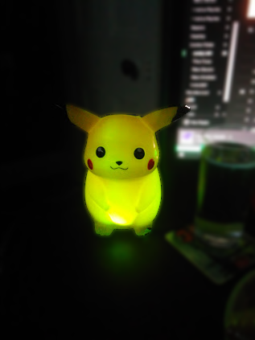

# Gemma Pikachu
This is a cut down version of my original adafruit trinket goggles project I wrote back in 2014.
This is an adafruit gemma trinket with a single neopixel ring and button soldered to it.
The required neopixel library can be downloaded from [here](https://github.com/adafruit/Adafruit_NeoPixel/archive/master.zip).

Sorry the pikachu itself is a piggy bank from when I was a kid, however this project also works great as an amulet or other sorts of jewellery.

## Trinket Goggles
I followed this [tutorial](https://learn.adafruit.com/kaleidoscope-eyes-neopixel-led-goggles-trinket-gemma/overview) to originally create my goggles and then added my own custom features.

Unfortunately I've lost the code for my goggles project. Although heavily modified, the concepts for some of the lighting effects still exist in this project.
